# Final Project

-   [ ] Read the [project requirements](https://vikramsinghmtl.github.io/420-5P6-Game-Programming/project/requirements).
-   [ ] Replace the sample proposal below with the one for your game idea.
-   [ ] Get the proposal greenlit by Vik.
-   [ ] Place any assets in `assets/` and remember to update `src/config.json`.
-   [ ] Decide on a height and width inside `src/globals.js`. The height and width will most likely be determined based on the size of the assets you find.
-   [ ] Start building the individual components of your game, constantly referring to the proposal you wrote to keep yourself on track.
-   [ ] Good luck, you got this!

---

# Sample Proposal - Sonic Game

## ✒️ Description

We will be implementing a Sonic The Hedgehog game! We're going to base ourselves off of Sonic 1 and have 1 complete working level. The player will take control of Sonic and attempt to navigate through the obstacles in the level such as enemies, item boxes, obstacles, gain enough speed to do a loop, etc. The win condition is basically trying to cross the level without dying as players can lose health from enemies. It will be a sidescrolling game, where the camera will follow the player. 

## 🕹️ Gameplay

The player begins at the title screen, and instructions containing how to play once they press Start. The gameplay is simple. The player enters the level and plays as Sonic. The player can move left and right with the left and right arrow keys, and jump with the Z key. The player can look up with the up arrow, which, after 3 seconds, will drag the camera up (This may be optional if we don't have time). The player can also crouch with the down arrow. If the player moves and presses the down arrow, Sonic will roll forward. Depending on the speed and momentum, he can roll very slowly, or very fast. If the player wants to stop moving, Sonic can stop abruptly by pressing the other direction key. For example, if Sonic is running right and the player presses left, he will skid and come to a stop. The player can also slow down by releasing the key.

The goal is to get to the sign post at the end of the level. Along the way, Sonic can collect rings, which are like coins from Mario. However, if he is damaged by a badnik (an enemy), he will take damage and lose his rings. He can collect them after he loses them, as they will be falling around him (May be an optional feature if we don't have time). To defeat a badnik, he needs to jump on it, similarly to Mario. There are also spikes to avoid, as if he hits them, he will take damage and lose rings. There can be platforms to jump on (Optional feature if we don't have time). There are three item boxes he can jump on: Speed shoes, to make him go faster for ~10 seconds, invincibility makes him invulnerable for ~10 seconds, and a ring box which grants 10 rings. The player is given 3 lives. If Sonic loses all lives, he will enter gameover, which returns the player to the title screen.

There is a HUD that displays the scores, time and rings on the top left, and his lives on the bottom left.

## 📃 Requirements

1. The user shall start the game from the title screen.
2. The user shall view instructions on how to play after pressing Start.
3. The user shall control Sonic using the arrow keys and the Z key.
4. The user shall move Sonic left by pressing the left arrow key.
5. The user shall move Sonic right by pressing the right arrow key.
6. The user shall make Sonic jump by pressing the Z key.
7. The user shall make Sonic look up by pressing the up arrow key.
8. The system shall drag the camera up after 3 seconds if Sonic is looking up (optional).
9. The user shall make Sonic crouch by pressing the down arrow key.
10. The user shall make Sonic roll forward by moving and pressing the down arrow key.
11. The system shall adjust Sonic’s roll speed based on his momentum.
12. The user shall reach the sign post at the end of the level to complete it.
13. The user shall collect rings throughout the level.
14. The system shall reduce Sonic's rings when he is damaged by a badnik or spikes.
15. The user shall be able to collect rings dropped after taking damage (optional).
16. The user shall defeat badniks by jumping on them.
17. The system shall cause Sonic to take damage if he touches spikes.
18. The system may include platforms for Sonic to jump on (optional).
19. The user shall jump on item boxes to gain power-ups.
20. The system shall grant Speed Shoes for ~10 seconds when Sonic jumps on the Speed Shoes box.
21. The system shall grant Invincibility for ~10 seconds when Sonic jumps on the Invincibility box.
22. The system shall grant 10 rings when Sonic jumps on the Ring box.
23. The system shall give the player 3 lives at the start of the game.
24. The system shall enter Game Over and return to the title screen if Sonic loses all lives.

### 🤖 Game State Diagram

> [!note]
> Remember that you'll need diagrams for not only game states but entity states as well.

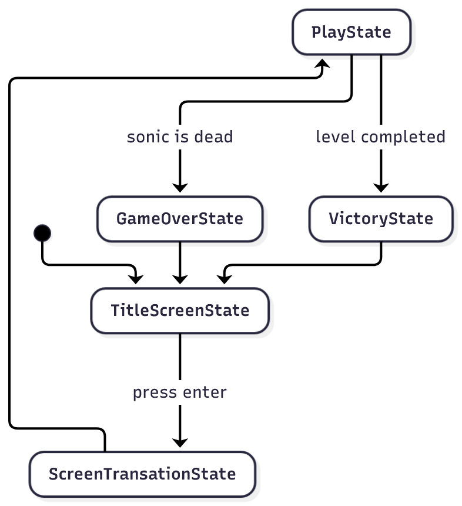

### 🤖 Sonic State Diagram

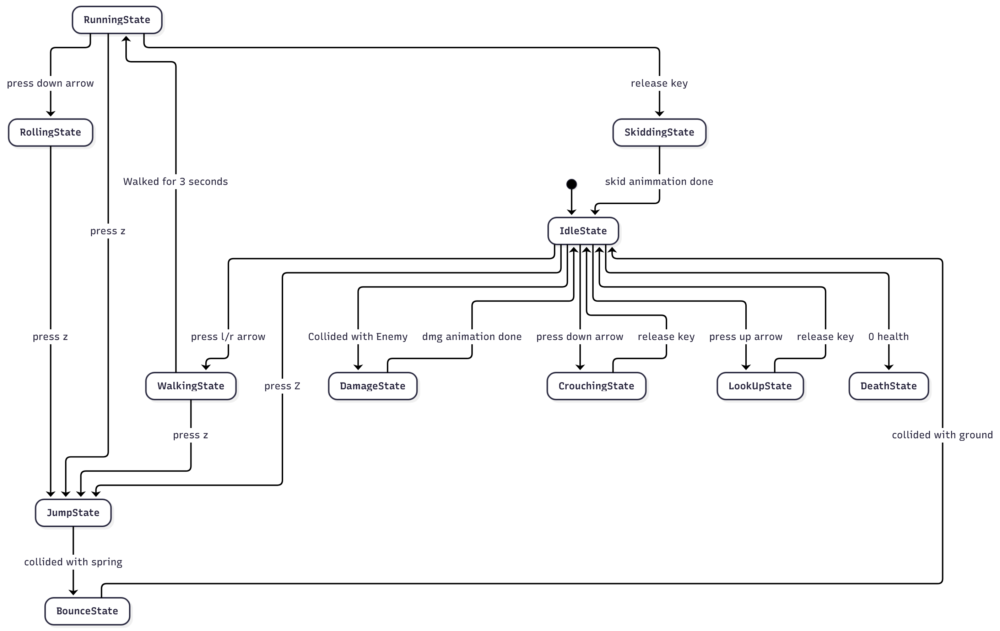

### 🗺️ Class Diagram

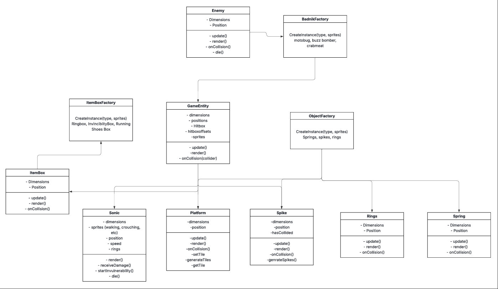

### 🧵 Wireframes

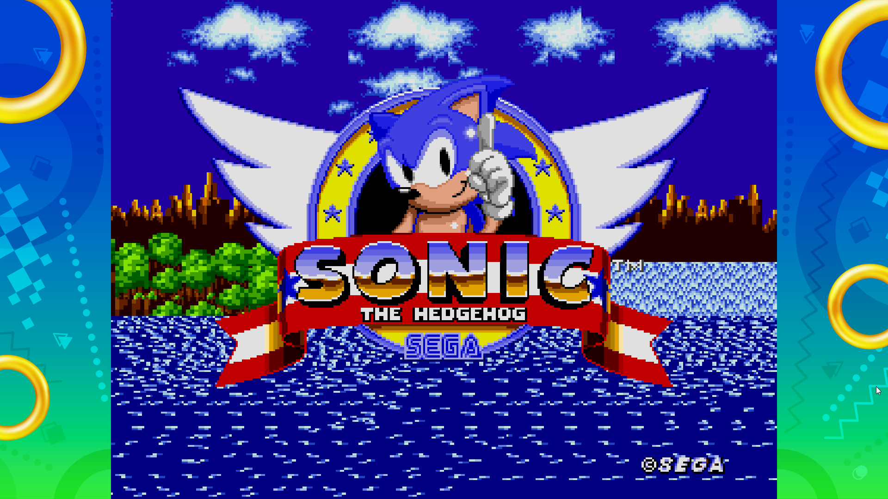

- Pressing any button will start the game.

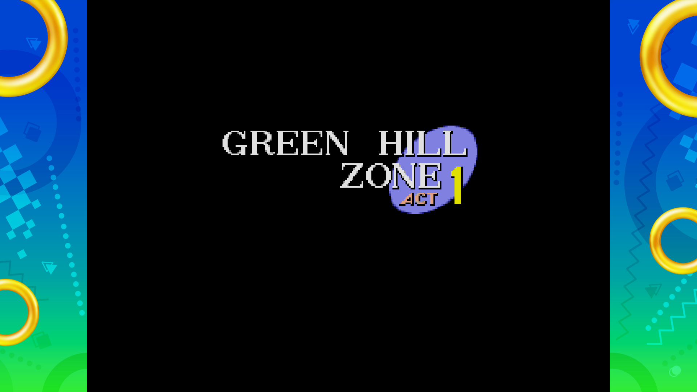

- Only one level, so one transition screen for this project.

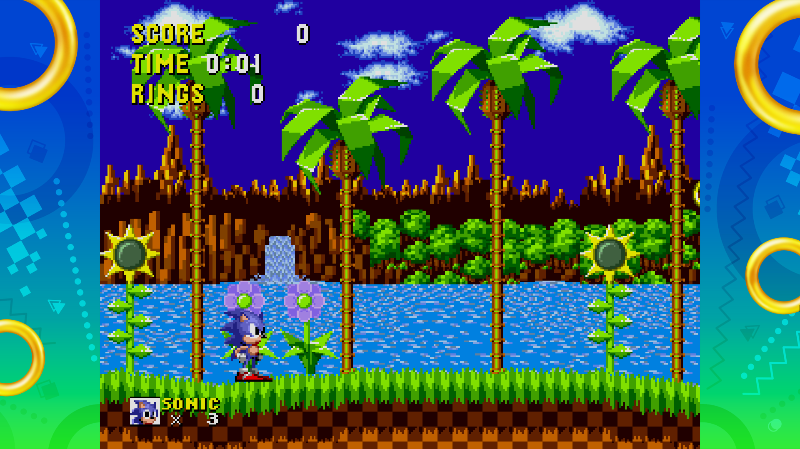a

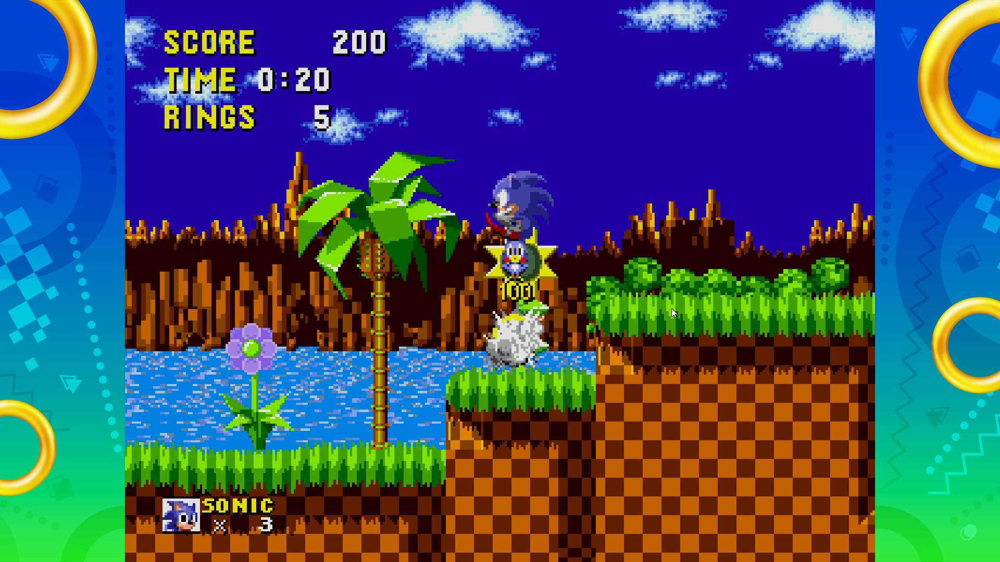

- Particles from defeating an enemy
- Score points added.
- Possible flicky (optional if we have time) that comes out of the badnik.

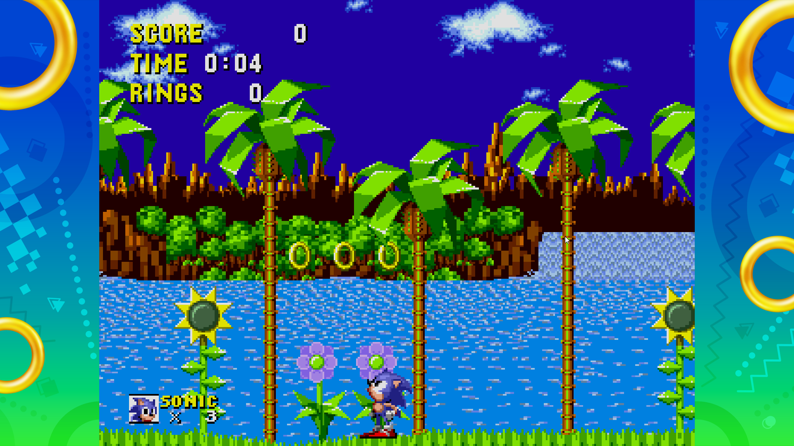

- Rings are placed like coins from Mario.

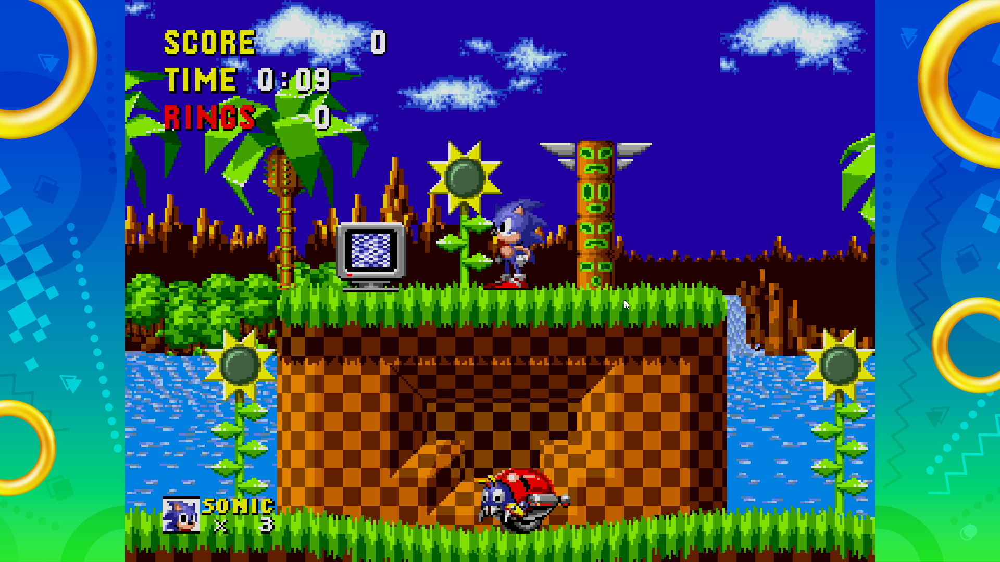

- A ring item box and a badnik

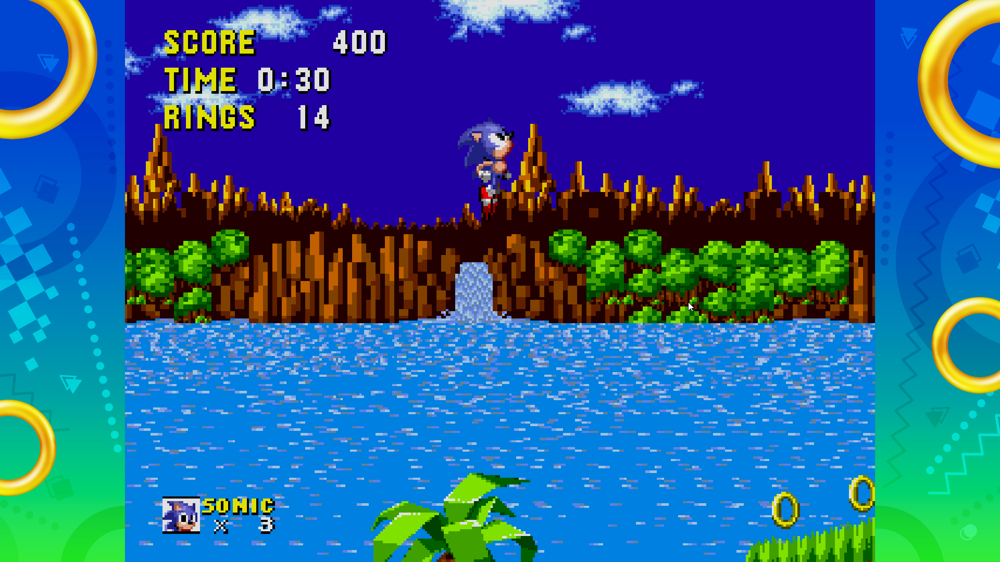

Jumping on a spring makes Sonic go upwards, changing his sprite.

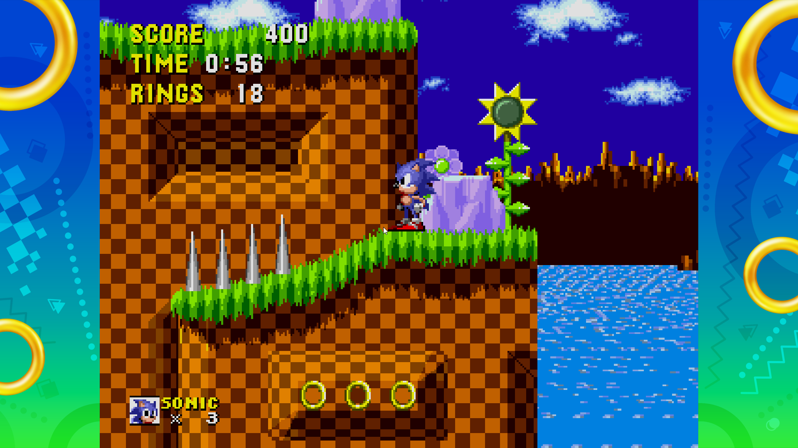

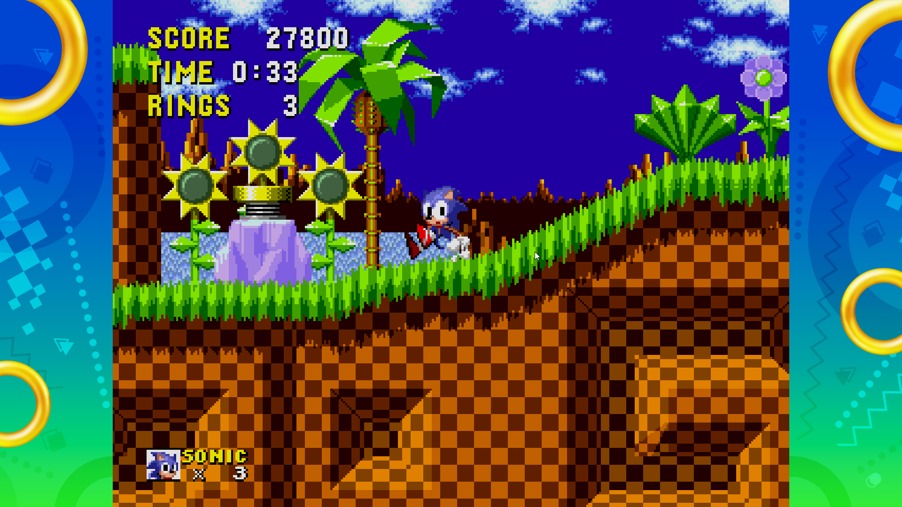

When going too fast, pressing the opposite direction makes him come to a stop.

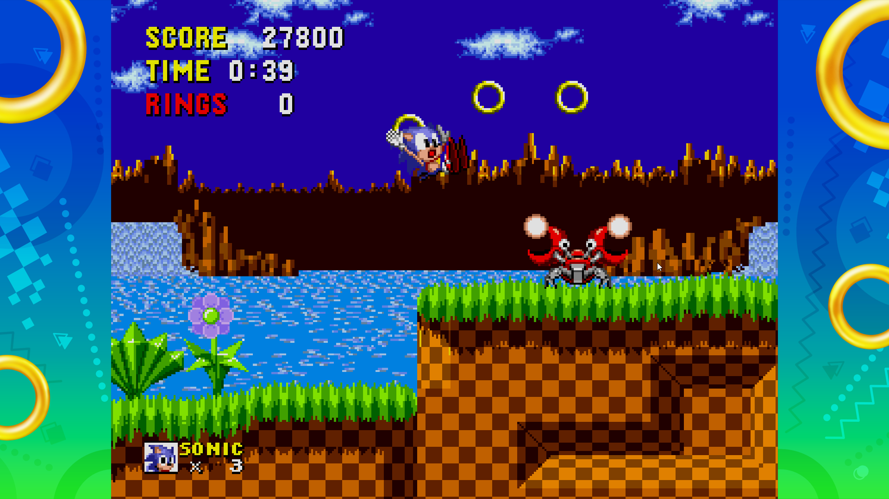

Taking damage makes him lose all his rings.

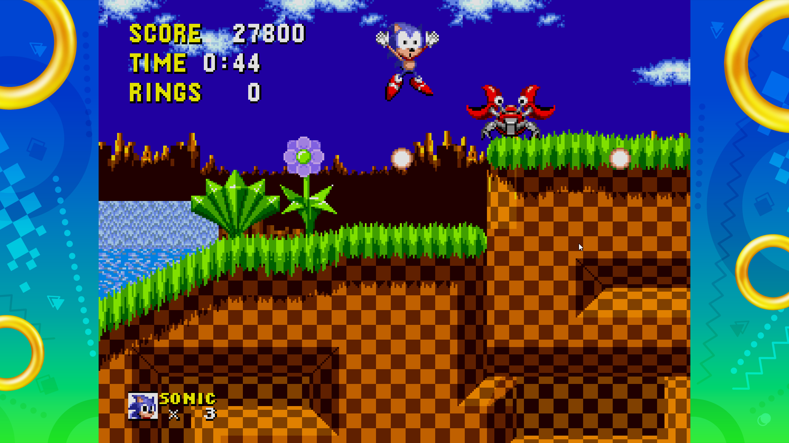

### 🎨 Assets

We are going to be using assets from Sonic The Hedgehog 1 to create the game. 

#### 🖼️ Images

-   Most images will be taken from Sprite Ressource, [Sprite Resource](https://www.spriters-resource.com).
-   Especially their [Sonic 1 Section](https://www.spriters-resource.com/sega_genesis/sonicth1/).

#### ✏️ Fonts

For fonts, we will use an external font that will be imported into our game. It mimics the font from the classic Sonic 1 game, so the feel for the player will be simillar to that of the original game.

-   [Sonic 1 Font](https://fontstruct.com/fontstructions/show/2709973/sonic-1-title-card-fixed-back)

#### 🔊 Sounds

All sounds were taken from [Sprite Ressource](https://sounds.spriters-resource.com/pc_computer/sonicorigins/asset/441860/).

### 📚 References

-   [Pokemon Rulebook](http://assets.pokemon.com/assets/cms2/pdf/trading-card-game/rulebook/xy8-rulebook-en.pdf)
